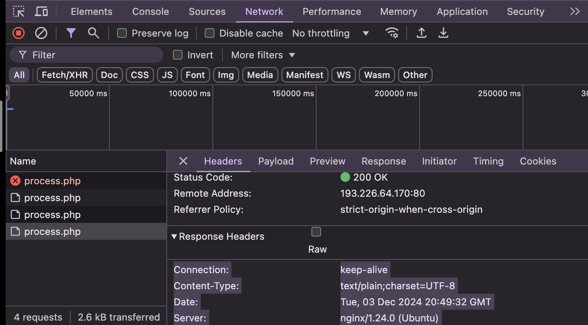

# Задание №1. Анализ HTTP-запросов
# Неверный запрос:
 - Какой метод HTTP был использован для отправки запроса? Ответ: POST
Какие заголовки были отправлены в запросе?
Accept-Language: en-GB,en-US;q=0.9,en;q=0.8,ru;q=0.7
Accept-Encoding: gzip, deflate
Referer: http://sandbox.usm.md/login/
Origin: http://sandbox.usm.md
Content-Type: application/x-www-form-urlencoded; charset=UTF-8
Accept: */*
User-Agent: Mozilla/5.0 (Macintosh; Intel Mac OS X 10_15_7) AppleWebKit/537.36 (KHTML, like Gecko) Chrome/131.0.0.0 Safari/537.36
X-Requested-With: XMLHttpRequest
Content-Length: 37
Connection: keep-alive
Host: sandbox.usm.md

- Какие параметры были отправлены в запросе? Ответ: username=student&password=studentpass
- Какой код состояния был возвращен сервером? Ответ: 401 (Unauthorized)
- Какие заголовки были отправлены в ответе?
connection:
keep-alive
content-type:
text/plain;charset=UTF-8
date:
Tue, 03 Dec 2024 20:44:43 GMT
server:
nginx/1.24.0 (Ubuntu)
transfer-encoding:
chunked

# Верный запрос:
- Какой метод HTTP был использован для отправки запроса? Ответ: POST
- Какие заголовки были отправлены в запросе?
Accept-Language: en-GB,en-US;q=0.9,en;q=0.8,ru;q=0.7
Accept-Encoding: gzip, deflate
Referer: http://sandbox.usm.md/login/
Origin: http://sandbox.usm.md
Content-Type: application/x-www-form-urlencoded; charset=UTF-8
Accept: */*
User-Agent: Mozilla/5.0 (Macintosh; Intel Mac OS X 10_15_7) AppleWebKit/537.36 (KHTML, like Gecko) Chrome/131.0.0.0 Safari/537.36
X-Requested-With: XMLHttpRequest
Content-Length: 32
Connection: keep-alive
Host: sandbox.usm.md

- Какие параметры были отправлены в запросе? Ответ: username=admin&password=password
- Какой код состояния был возвращен сервером? Ответ: 200 OK
- Какие заголовки были отправлены в ответе?
 Sconnection:
keep-alive
content-type:
text/plain;charset=UTF-8
date:
Tue, 03 Dec 2024 20:49:32 GMT
server:
nginx/1.24.0 (Ubuntu)
transfer-encoding:
chunked

# Задание №2. Составление HTTP-запросов
- Составьте GET-запрос к серверу по адресу http://sandbox.com, указав в заголовке User-Agent ваше имя и фамилию.
GET / HTTP/1.1
Host: sandbox.com
User-Agent: Zubco Andrei

- Составьте POST-запрос к серверу по адресу http://sandbox.com/cars, указав в теле запроса следующие параметры:
make: Toyota
model: Corolla
year: 2020
POST /cars HTTP/1.1
Host: sandbox.com
User-Agent: Zubco Andrei
Content-Type: application/json
model=Corolla&make=Toyota&year=2020

- Составьте PUT-запрос к серверу по адресу http://sandbox.com/cars/1, указав в заголовке User-Agent ваше имя и фамилию, в заголовке Content-Type значение application/json и в теле запроса следующие параметры:
{
  "make": "Toyota",
  "model": "Corolla",
  "year": 2021
}
PUT /cars/1 HTTP/1.1
Host: sandbox.com
User-Agent: Zubco Andrei
Content-Type: application/json
{
  "make": "Toyota",
  "model": "Corolla",
  "year": 2021
}

- Напишите один из возможных вариантов ответа сервера следующий запрос.
POST /cars HTTP/1.1
Host: sandbox.com
Content-Type: application/json
User-Agent: John Doe
model=Corolla&make=Toyota&year=2020

Ответ: HTTP/1.1 201 Created Предположите ситуации, когда сервер может вернуть HTTP-коды состояния 200, 201, 400, 401, 403, 404, 500. Ответ: 200 - в ответ на правильный GET запрос 201 - в ответ на правильный POST, PUT, DELETE запрос 400 - в ответ на неправильно составленный запрос 401 - в случае если пользователь не аутентифицирован на сервере 403 - в случае если пользователь не обладает правами на выполнение запроса 404 - в случае если не найден запрашиваемый ресурс 500 - в случае если запрос не смог быть обработан на сервере

# Задание №3. Дополнительное задание. HTTP_Quest
Congratulations, Zubco Andrei! You have successfully completed the quest! Here is your secret: OjoKFxEmEAktF1Q3ClcIP0JEVg==
secret: OjoKFxEmEAktF1Q3ClcIP0JEVg==

